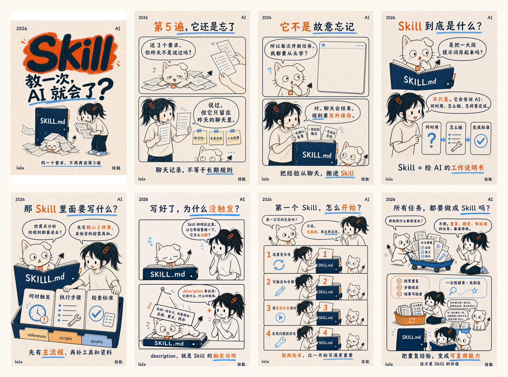

# 小红书 AI 知识图文 Skill

一个面向 AI 知识创作者的 Codex Skill：从关键词、文章、截图或零散笔记中判断选题，核验概念，规划轮播脚本，指导统一风格生图，用评测集逐页验收，并完成发布前检查。

它不是“把素材缩写成几页”，而是帮助你回答三个问题：**这一篇值得讲什么、怎样让小白看懂、怎样稳定产出合格成品。**

## 成品案例

下面是首个完整案例：用 8 张小红书图文解释“Skill 是什么、为什么需要、怎样开始”。



## 能做什么

- **分析选题**：从大段文本、多份文件、截图和关键词中提炼最值得发的一篇，而不是盲目总结全部素材。
- **核验概念**：优先检索官方文档、标准和原始论文，交叉确认“是什么、为什么、怎么用”。
- **规划图文**：先确认学习目标和页数，再输出封面、痛点、定义、机制、例子与结论。
- **编写脚本**：给出每页文字、场景、人物动作、表情、构图和生图提示词。
- **统一视觉**：固定 3:4 手绘版式、字体层级、配色，以及拉拉与猫咪 IP 规范。
- **评测生图**：检查文字、概念、角色、肢体、物品方向、版式和发布安全，并使用真实修改意见进行回归测试。
- **准备发布**：生成推荐标题、备选标题、200 字以内正文、话题建议和 AI 内容声明提醒。
- **检查编辑器**：识别图片加载失败、顺序错误、普通井号文字未转为正式话题等问题，并在最终发布前请求确认。

## 适合内容

| 输入类型 | 示例 | Skill 会做什么 |
| --- | --- | --- |
| AI 关键词 | Agent、RAG、AIGC、Skill | 先确认含义，再选择适合小白的讲解角度 |
| 长文章或课程笔记 | 章节、讲义、逐字稿 | 判断哪些内容适合本篇，哪些应拆成下一篇 |
| 截图或文件 | 产品页面、研究报告、课堂资料 | 提取重点、核验事实并转成轮播脚本 |
| 零散观点 | 灵感、句子、聊天记录 | 补足逻辑，形成一个明确的学习承诺 |
| 已生成图片 | 封面、内页、角色图 | 按评测集找问题，给出局部、可执行的修改要求 |
| 发布草稿 | 标题、正文、图片和标签 | 检查成品与平台编辑器状态 |

不适合直接使用的情况：只想批量搬运内容、未经核验地追热点、模仿他人水印或角色、用故事掩盖概念错误。

## 工作流程

1. **读取素材**：识别主题、证据、受众和潜在歧义。
2. **分析选题**：评估小白相关性、可视化程度、实用价值、事实把握和差异化。
3. **搜索核验**：使用最新一手来源确认概念；一词多义时先向用户澄清。
4. **确认方案**：给出选题角度、读者收获、页数和每页任务，获得确认后再生图。
5. **编写脚本**：优先使用对话、动作、对比和因果关系，让故事服务概念。
6. **生成图片**：逐页生成或修改，始终带上统一视觉与角色锚点。
7. **逐页评测**：硬门槛全部通过，质量评分达到要求后才接受。
8. **准备发布**：输出标题、正文、话题和 AI 内容声明提醒。
9. **发布前复核**：检查图片加载、顺序、正式话题、预览和可见范围；最终点击前再次确认。

详细规则见：

- [内容工作流](xiaohongshu-ai-knowledge-post/references/content-workflow.md)
- [视觉系统](xiaohongshu-ai-knowledge-post/references/visual-system.md)
- [生图评测集](xiaohongshu-ai-knowledge-post/references/eval-set.md)
- [发布检查表](xiaohongshu-ai-knowledge-post/references/publish-checklist.md)

## 安装

### 方式一：克隆仓库

```bash
git clone https://github.com/LalaGa-1119/xiaohongshu-ai-knowledge-skill.git
```

将技能目录复制到 Codex 的 skills 目录：

```bash
cp -R xiaohongshu-ai-knowledge-skill/xiaohongshu-ai-knowledge-post ~/.codex/skills/
```

重新启动 Codex，或开启一个新任务，让技能被重新发现。

### 方式二：只下载 Skill

只需要保留完整的 `xiaohongshu-ai-knowledge-post/` 目录，不要单独复制 `SKILL.md`，因为工作流依赖 `references/` 中的视觉规范、评测集和发布检查表。

## 使用

显式调用技能：

```text
使用 $xiaohongshu-ai-knowledge-post，把这份 Agent 课程笔记整理成面向小白的小红书知识图文。先分析选题，不要直接生图。
```

也可以投喂混合素材：

```text
使用 $xiaohongshu-ai-knowledge-post。这里有一篇文章、三张截图和我的几条想法，请判断最值得发的一篇，并规划页数。
```

评测已经生成的图片：

```text
使用 $xiaohongshu-ai-knowledge-post，按评测集检查这 6 张图。逐页告诉我通过或返工，以及必须修改的地方。
```

准备发布文案：

```text
使用 $xiaohongshu-ai-knowledge-post，为这组图提供 1 个推荐标题、2 个备选标题、200 字以内正文和适合的话题。
```

Skill 默认先给出选题与页数方案。只有在概念指向、页数和视觉方向明确后，才进入逐页生图。

## 视觉系统

- **画布**：3:4 竖版，暖米白纸张背景。
- **线条**：深藏青或黑色手绘墨线，略有手作不规则但保持清楚。
- **强调色**：藏青、天蓝和橙色，避免颜色过多。
- **文字层级**：封面主体词最大；内页保持“标题—观点—辅助说明”三级层级。
- **版式**：解释文字放在顶部或底部，中间留给人物、物品或图解；气泡只用于真实说话或思考。
- **拉拉**：高马尾、米白 T 恤、深色宽松裤、蓝白运动鞋、橙色发夹；生动但不过分夸张。
- **猫咪**：小而瘦，一只耳朵竖起、一只折叠，橙色挂牌、箭头尾尖；肢体和比例必须正常。
- **连续性**：书、卡片、挂牌等物品在不同格之间保持合理方向和状态。

视觉一致不是每页复制同一构图。角色、色彩和质感稳定即可，场景和人物数量应由内容决定。

## 项目结构

```text
xiaohongshu-ai-knowledge-skill/
├── README.md
├── LICENSE
└── xiaohongshu-ai-knowledge-post/
    ├── SKILL.md
    ├── agents/
    │   └── openai.yaml
    ├── assets/
    │   └── case-skill-carousel.png
    └── references/
        ├── content-workflow.md
        ├── eval-set.md
        ├── publish-checklist.md
        └── visual-system.md
```

`SKILL.md` 只保留核心流程，详细规范按需从 `references/` 加载，减少无关上下文占用。

## 成品检查

每一页先通过 7 个硬门槛：

1. 文字完整、准确、清晰，气泡属于正确角色；
2. 概念没有错误或被类比偷换；
3. 拉拉与猫咪保留固定角色特征；
4. 没有多余爪子、手指、四肢、脸或尾巴；
5. 书本、挂牌、卡片等物品方向和状态合理；
6. 使用 3:4 版式，阅读顺序清楚；
7. 不复制参考作者水印，不冒充他人，不滥用第三方标志。

硬门槛通过后，再对钩子、单页重点、小白理解、故事作用、字体层级、留白、手绘一致性、表情尺度、角色比例、配色和图文一致性评分。

发布前还要确认：

- 图片数量、顺序和封面正确；
- 草稿恢复或刷新后没有空白图片；
- 标签通过平台话题选择器添加并成为正式话题，而不是普通黑色 `#文字`；
- 适用时已选择“笔记含 AI 合成内容”；
- 点击发布前已取得用户的最终确认；
- 点击后已在结果页或笔记管理列表核对成功。

## 授权说明

项目代码与文档采用 [MIT License](LICENSE)。你可以使用、复制、修改、合并、发布和分发，但需保留原始版权与许可声明。

案例图片用于展示本 Skill 的工作方式。开源授权不代表你可以复制其他创作者的水印、角色设计或受保护内容；使用参考图时，应提取抽象的构图、配色与叙事规律，并建立自己的角色资产。
